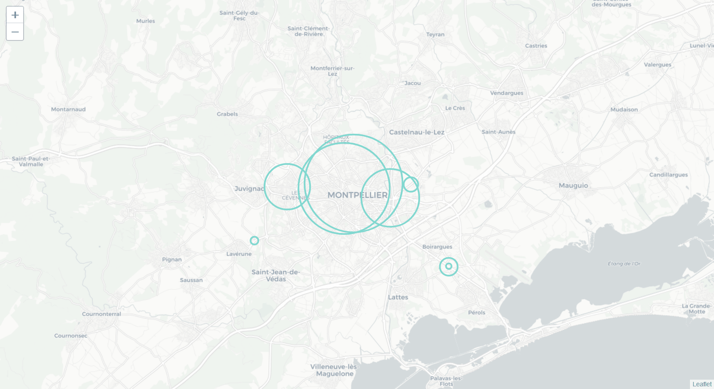

## Overview

The first motivation of this project is to predict the number of bicycle passing between 00:01 AM and 09:00 AM on Friday, April 2nd.

The second is to perform some data visualization blending time and space representation using a dataset of bike traffic in Montpellier. 

## Prediction 

The methodology used for the prediction is presented in prediction.ipynb file.

## Visualization 

# Widget 

This widget displays plots of the daily trafic intensity for each of the 10 counters : 

# GIF animation 

To run the visualization package locally:

* Clone this repository.
* On a terminal, change directory to visualization folder and run `pip install .`
* The package requires Mozilla Firefox as a browser in order to launch GIF animation
* For this install geckodriver.exe, you can find link here : https://github.com/mozilla/geckodriver/releases
* Add geckodriver path's folder to your PATH system varaibles.Make sure you launch terminals to set changements.